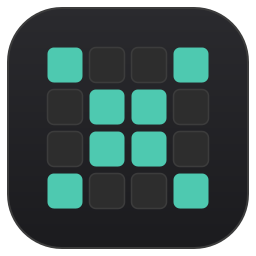

<p align="center">
  
</p>

# BinCalcX — Programmer's Calculator

[](https://github.com/himingway/BinCalcX/actions/workflows/ci.yml)
[](LICENSE)

A cross-platform (Windows / Linux) **RPN programmer's calculator** built with
**C++17** and **Qt 6 (Widgets)**, structured as a clean **MVC** application.
Designed for hardware engineers: VS Code-grade theming, a textless 64-bit grid,
per-register bit widths, SystemVerilog-literal stack display, and per-base
colour anchoring.


## Features

### Number bases & accent colours

**Four bases** — BIN / OCT / DEC / HEX, switchable by clicking the base labels.
The keypad auto-enables/disables keys per base. Each base tints the active
chrome with a distinct accent — **HEX green, DEC blue, OCT amber, BIN purple**
— colouring the active field, lit bits, ENTER key, and the X register for
instant visual anchoring.

### Per-register bit width

Each register on the RPN stack carries its **own bit width** (1–64). The global
8/16/32/64 selector sets X's width; selecting a bit range on the grid also sets
X's width to the slice size. All values are masked to their register's width,
signed interpretation is relative to it, and shifts are clamped. This makes
hardware idioms natural: extracting a field, concatenating buses of different
widths, and bit-reducing wide values.

### Textless bit grid

A 4×16 cell grid with **no `0`/`1` text** inside. Unlit cells are subtle frames
with alternating nibble shades so byte boundaries read instantly; lit cells fill
with the active accent. Tiny grey nibble-axis labels (`63 59 55 51 …`) sit
above each group.

- **Click** any cell to toggle that bit.
- **Hover** shows `Bit: N | Mask: 0x…` in the status line.
- **Marquee select** — drag across cells to select a bit range; the selected
  segment's value appears in the status line as a SystemVerilog literal.
- **Keyboard navigation** — arrow keys move a focus ring across the grid;
  **Space** toggles the focused bit.
- Cells beyond the current register width are **greyed out** as a hardware-
  truncation cue.

### SystemVerilog-literal stack

The four-register RPN stack is printed as **SystemVerilog literals** — e.g.
`8'hFF`, `4'b1101`, `32'hDEAD_BEEF` — one per register (T · Z · Y · X), with
the width prefix matching each register's own bit width. The X register is
rendered **large, bold, and accent-filled** as the primary readout; T and Z are
subdued; Y sits in between.

### Simultaneous multi-base readout

- **Bit grid** — visual binary.
- **OCT / DEC / HEX** fields — all visible at once, with the active base
  highlighted.
- **CHR** — full 64-bit decode, always shown as exactly 8 monospace cells
  (MSB→LSB); non-printable bytes display as `·`.

### Operations

| Category | Keys |
|---|---|
| Arithmetic | `+` `-` `*` `/` `MOD` |
| Bitwise | `AND` `OR` `XOR` `NOT` |
| Shift (binary) | `SHL` `SHR` — shift Y by the X amount |
| Shift (in-place) | `◀` `▶` — single-bit left/right shift on X (logical when unsigned, arithmetic when signed) |
| Unary | `+/-` (two's complement within X's width) |
| Stack | `ENTER` `Rv` (roll down) `X<>Y` (swap) `CLx` `CLR` |
| Hardware | `{,}` — concatenate `{Y,X}` by register widths; `{N}` — replicate `{N{X}}`; slice — extract a bit range |
| Clipboard | `Ctrl+C` copy (active base, or selected bit range); `Ctrl+V` paste (supports `0x`/`0b`/`0o` prefixes and separators) |

### Themes & layout

- **Dark / light themes** — charcoal `#1E1E1E` (not pure black) or clean light;
  toggle via toolbar.
- **Monospace everywhere** — all fields, labels, and buttons.
- Semantic key colouring: neutral digit keys, low-saturation blue operators,
  **coral-text danger keys** (`CLx` / `CLR`), and a **full-width accent ENTER**
  as the visual anchor.
- **Compact & capped** — micro margins (4–6 px), tight 2–4 px spacing, short
  buttons; window size is clamped so it stays a tidy overlay beside code or
  waveforms.
- **Stay-on-top** — toggle with `Ctrl+T` or the toolbar; preference remembered.
- **Preference persistence** — theme, bit width, base, signedness, and
  stay-on-top are remembered across runs via `QSettings`.

## Architecture (MVC)

| Layer | File | Responsibility |
|---|---|---|
| **Model**    | `calculatormodel.{h,cpp}` | Owns all state: four-register RPN stack with per-register widths, input buffer, base, signed mode, bit width. Pure headless `QObject`; masks every result to the relevant register width and sign-extends for display. |
| **View**     | `calculatorview.{h,cpp}`   | Passive widget. Emits high-level intents (`digitPressed`, `binaryOpPressed`, `bitWidthRequested`, `themeToggled`, …); two palettes plus a **base-dependent accent** re-skin it at runtime. Fixed 64-cell grid with marquee select, keyboard focus ring, and greyed-out out-of-width cells. |
| **Controller** | `calculatorcontroller.{h,cpp}` | Glue: View intents → Model slots; refreshes the View on every Model change (`displayChanged` / `bitWidthChanged`); persists and restores preferences. |

```
 User ─► View (intent) ─► Controller ─► Model (slot)
                                               │
 View ◄── set...() ── Controller ◄── displayChanged ─┘
```

View and Model never reference each other; intent tokens are plain strings
(`"ADD"`, `"ENTER"`, `"HEX"`, `"CONCAT"`, …).

## Build

Requires Qt 6 (Core + Widgets) and a C++17 compiler.

```bash
qmake6 bincalc.pro && make -j$(nproc) && ./BinCalc     # primary
# or, with CMake:
cmake -S . -B build -DCMAKE_BUILD_TYPE=Release && cmake --build build -j && ./build/BinCalc
```

### Tests

Headless model tests (`tests/test_model.cpp`) are built through CMake so moc
and linking are handled correctly:

```bash
cmake -S . -B build -DCMAKE_BUILD_TYPE=Release -DBINCALC_BUILD_TESTS=ON
cmake --build build -j$(nproc)
ctest --test-dir build --output-on-failure
```

Tests cover arithmetic, bitwise ops, shifts, NOT, bit-toggle, negate, base
conversion, stack roll/swap, bit-width masking / sign-extension / shift
clamping, per-register widths, concatenation, replication, and the T/Z/Y/X
display ordering.

## Keyboard

| Key | Action | Key | Action |
|---|---|---|---|
| `0`–`9`, `A`–`F` | digit (current base) | `Enter` | ENTER (or push selection) |
| `+` `-` `*` `/` `%` | arithmetic / mod | `Backspace` | backspace |
| `&` `\|` `^` | AND / OR / XOR | `Esc` | cancel selection, or CLR |
| `~` / `!` | NOT | `Delete` | CLx |
| `<` / `(` | SHL | `R` | roll down |
| `>` / `)` | SHR | `S` | swap X↔Y |
| `_` / `N` | negate | `Space` | toggle focused bit |
| `Ctrl+C` | copy X or selection | `← ↑ ↓ →` | move bit-grid focus |
| `Ctrl+V` | paste number → X | `Ctrl+T` | toggle stay-on-top |

## RPN examples

```
12 ENTER 5 +          → 17
FF XOR 0F   (HEX)     → F0
200 ENTER 100 + (W8)  → 44         (masked to 8 bits)
12'hABC {,} 4'h3      → 16'h0ABC3  ({Y,X} concatenation)
8'hFF {N}             → 32'hFFFF_FFFF  (replicate X, N = Y)
```

## License

MIT — see [LICENSE](LICENSE).
