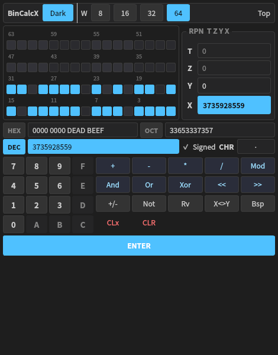

# BinCalcX — Programmer's Calculator

A cross-platform (Windows / Linux) RPN programmer's calculator built with
**C++17** and **Qt 6 (Widgets)**, structured as a clean **MVC** application.
Geared toward chip engineers: VS Code-grade theming, a textless 64-bit grid,
per-base colour anchoring, and a tight, oscilloscope-style readout.



## Features

- **Four number bases** — BIN / OCT / DEC / HEX, switchable by clicking the base
  labels. The keypad auto-enables/disables keys per base. **Each base tints the
  whole active chrome** — HEX green, DEC blue, OCT amber, BIN purple — across
  the active field, lit bits, ENTER and the X register, for instant visual
  anchoring.
- **Switchable bit width — 8 / 16 / 32 / 64**. Values are masked to the width,
  negatives shown as two's complement within it, shifts clamped. The bit grid
  always shows **all 64 cells**; cells past the active width are **greyed out**
  as a hardware-truncation cue.
- **Textless bit grid** — 4×16 cells, no `0/1` text inside. Unlit cells are
  subtle frames with **alternating nibble shades** so byte boundaries read
  instantly; lit cells fill with the active accent. Tiny grey nibble axis labels
  (`63 59 55 51 …`) sit above each group. Click any cell to toggle that bit;
  **hover** shows `Bit: N | Mask: 0x…` in a quiet status line.
- **Simultaneous multi-base readout** — binary (grid), OCT, DEC, HEX + ASCII
  **CHAR**.
- **RPN stack** (T · Z · Y · X) in a widened right panel: T/Z subdued, Y medium,
  **X large, bold, accent-filled** — the main readout.
- **Operations**: `+ - * / MOD`, `AND OR XOR NOT`, `SHL SHR`, `+/-`, plus stack
  commands `ENTER`, `CLx`, `CLR`, `Rv`, `X<>Y`.
- **VS Code-grade dark / light themes** — charcoal `#1E1E1E` (not pure black),
  **monospace everywhere**, semantic colouring: neutral keys, low-sat-blue
  operators, **coral-text danger keys** (`CLx`/`CLR`) on transparent ground, a
  **full-width accent ENTER** as the visual anchor.
- **Compact & capped** — micro margins (4–6 px), tight 2–4 px spacing, short buttons,
  window size clamped so it stays a tidy overlay beside code or waveforms.
- **Preference persistence** — theme, bit width, base, signedness, stay-on-top
  remembered across runs (`QSettings`).
- **Full keyboard** support.

## Architecture (MVC)

| Layer | File | Responsibility |
|-------|------|----------------|
| **Model**    | `calculatormodel.{h,cpp}` | Owns all state: 4-register RPN stack, input buffer, base, signed mode, bit width. Pure headless `QObject`; masks every result to the width and sign-extends for display. |
| **View**     | `calculatorview.{h,cpp}`   | Passive widget. Emits high-level intents (`digitPressed`, `binaryOpPressed`, `bitWidthRequested`, `themeToggled`, …); two palettes + a **base-dependent accent** re-skin it at runtime. Fixed 64-cell grid greys out past the width. |
| **Controller** | `calculatorcontroller.{h,cpp}` | Glue: View intents → Model slots; refreshes the View on every Model change (`displayChanged`/`modeChanged`/`bitWidthChanged`); persists/restores preferences. |

```
 User ─► View (intent) ─► Controller ─► Model (slot)
                                               │
 View ◄── set...() ── Controller ◄── displayChanged ─┘
```

View and Model never reference each other; intent tokens are plain strings
(`"ADD"`, `"ENTER"`, `"HEX"`, …).

## Build

Requires Qt 6 (Core + Widgets) + a C++17 compiler.

```bash
qmake6 bincalc.pro && make -j$(nproc) && ./BinCalc     # primary
# or, with CMake:
cmake -S . -B build -DCMAKE_BUILD_TYPE=Release && cmake --build build -j && ./build/BinCalc
```

### Tests

Headless model tests (`tests/test_model.cpp`, 26 assertions) are built through
CMake so moc and linking are handled correctly:

```bash
cmake -S . -B build -DCMAKE_BUILD_TYPE=Release -DBINCALC_BUILD_TESTS=ON
cmake --build build -j$(nproc)
ctest --test-dir build --output-on-failure
```

They cover arithmetic, bitwise ops, shifts, NOT, bit-toggle, negate, base
conversion, stack roll/swap, **bit-width masking / sign-extension / shift
clamping**, and the T/Z/Y/X display ordering.

## Keyboard

| Key | Action | Key | Action |
|-----|--------|-----|--------|
| `0`–`9`, `A`–`F` | digit (current base) | `Enter` | ENTER |
| `+` `-` `*` `/` `%` | arith / mod | `Backspace` | backspace |
| `&` `\|` `^` | AND / OR / XOR | `Esc` | CLR |
| `~` / `!` | NOT | `Delete` | CLx |
| `<` `>` | SHL / SHR | `R` | roll |
| `_` / `N` | negate | `S` | swap X↔Y |

Theme and bit width are toolbar-controlled (mouse).

## RPN example

`12 ENTER 5 +` → `17`. · `FF XOR 0F` (HEX) → `F0`. · Width 8, `200 ENTER 100 +` → `44`.

